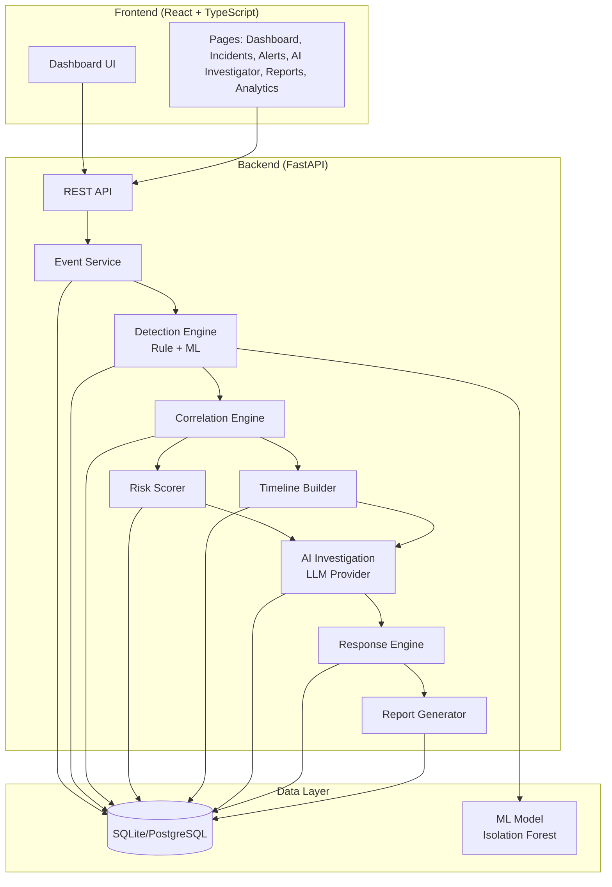

# Nexus One

AI-powered Security Operations Center (SOC) platform with real-time threat detection, incident correlation, AI-assisted investigation, and automated response recommendations.

## Overview

Nexus One is a comprehensive SOC platform that ingests security events, detects threats using rule-based and ML-based detection engines, correlates alerts into incidents, scores risk, reconstructs attack timelines, provides AI-assisted investigation, and generates prioritized response recommendations with detailed incident reports.

## Architecture



## Features

### Core Capabilities

- **Security Event Ingestion**: Normalized event ingestion from multiple sources
- **Rule-Based Detection**: Configurable detection rules with threshold and pattern matching
- **ML Anomaly Detection**: Isolation Forest-based anomaly detection for unusual patterns
- **Event Correlation**: Automatic correlation of alerts into incidents based on time, entities, and attack patterns
- **Risk Scoring**: Deterministic risk scoring with explainable factors (0-100 scale, LOW/MEDIUM/HIGH/CRITICAL)
- **Attack Timeline**: Chronological reconstruction of attack progression with MITRE ATT&CK stage mapping
- **AI Investigation**: LLM-powered incident investigation with evidence-based analysis (OpenAI-compatible or demo mode)
- **Response Recommendations**: Prioritized, evidence-based response recommendations requiring analyst approval
- **Incident Reports**: Comprehensive incident reports in JSON and HTML formats
- **One-Click Demo**: Realistic multi-stage attack scenario demonstration

### Frontend

- **Dashboard**: Real-time KPIs, security operations flow visualization, attack scenario runner
- **Incidents**: Incident list with risk levels, attack stages, and detailed investigation views
- **Alerts**: Alert management with detection source tracking (rule vs ML)
- **AI Investigator**: AI investigation interface with structured findings and evidence citations
- **Reports**: Incident report viewer with evidence, analysis, and recommendations
- **Analytics**: Security metrics and trend visualization
- **Assets**: Asset inventory management
- **Settings**: Configuration interface for AI provider and system settings

### Demo Attack Scenario

The platform includes a one-click demo that simulates a realistic multi-stage attack:

1. **Brute Force Login**: Multiple failed login attempts from suspicious IP
2. **Successful Compromise**: Successful login after brute force
3. **Privilege Escalation**: Escalation from viewer to root via sudo
4. **Data Exfiltration**: Large data transfer to external IP

The demo exercises the complete pipeline: event ingestion → detection → correlation → risk scoring → AI investigation → recommendations → report generation.

## Tech Stack

### Backend
- **Framework**: FastAPI 0.141+
- **Database**: SQLAlchemy 2.0+ with SQLite (development) / PostgreSQL (production)
- **Validation**: Pydantic 2.13+
- **ML**: scikit-learn 1.9+ (Isolation Forest)
- **Testing**: pytest 9.0+, httpx 0.28+

### Frontend
- **Framework**: React 18.3+
- **Language**: TypeScript 5.6+
- **Build Tool**: Vite 5.4+
- **Routing**: React Router 6.30+
- **Charts**: Recharts 2.15+
- **Testing**: Vitest 2.1+, Testing Library

### Infrastructure
- **Containerization**: Docker, Docker Compose
- **Reverse Proxy**: Nginx (frontend container)

## Installation

### Prerequisites

- Python 3.14+ (backend)
- Node.js 20+ (frontend)
- npm or yarn (frontend)
- Docker and Docker Compose (optional, for containerized deployment)

### Local Development Setup

#### Backend

1. Clone the repository:
```bash
git clone <repository-url>
cd nexus-one
```

2. Create and activate virtual environment:
```bash
python -m venv venv
source venv/bin/activate  # Linux/macOS
venv\Scripts\activate     # Windows
```

3. Install dependencies:
```bash
pip install -r requirements.txt
```

4. Configure environment:
```bash
cp .env.example .env
# Edit .env with your settings
```

5. Initialize database:
```bash
# Database is automatically initialized on first run
# To seed with default detection rules:
# Set SEED_RULES=true in .env
```

6. Start backend server:
```bash
uvicorn main:app --reload --host 0.0.0.0 --port 8000
```

Backend available at:
- **API**: http://localhost:8000
- **Interactive docs**: http://localhost:8000/docs
- **Alternative docs**: http://localhost:8000/redoc
- **Health check**: http://localhost:8000/health

#### Frontend

1. Navigate to frontend directory:
```bash
cd frontend
```

2. Install dependencies:
```bash
npm install
```

3. Configure environment:
```bash
cp .env.example .env
# For development, leave VITE_API_BASE_URL empty to use Vite proxy
# For production, set VITE_API_BASE_URL=http://your-backend-url
```

4. Start development server:
```bash
npm run dev
```

Frontend available at: http://localhost:5173

The Vite dev server proxies `/api` and `/health` requests to the backend.

### Docker Deployment

1. Build and start containers:
```bash
docker-compose up --build
```

2. Access the application:
- **Frontend**: http://localhost
- **Backend API**: http://localhost:8000
- **API docs**: http://localhost:8000/docs

3. Stop containers:
```bash
docker-compose down
```

4. Stop and remove volumes:
```bash
docker-compose down -v
```

## Environment Variables

### Backend (.env)

| Variable | Default | Description |
|----------|---------|-------------|
| `APP_NAME` | Nexus One | Application name |
| `APP_ENV` | development | Environment (development/production) |
| `DEBUG` | true | Enable debug mode |
| `LOG_LEVEL` | INFO | Logging level |
| `DATABASE_URL` | sqlite:///./nexus_one.db | Database connection string |
| `SECRET_KEY` | dev-secret-key-change-in-production | Security key (change in production!) |
| `ALGORITHM` | HS256 | JWT algorithm |
| `ACCESS_TOKEN_EXPIRE_MINUTES` | 30 | JWT token expiration |
| `API_V1_PREFIX` | /api/v1 | API version prefix |
| `CORS_ORIGINS` | http://localhost:5173,http://127.0.0.1:5173 | Comma-separated CORS allowed origins |
| `SEED_RULES` | false | Seed database with default detection rules |
| `ML_MODEL_PATH` | None | Path to trained ML model |
| `LLM_PROVIDER` | None | AI provider: `openai`, `demo`, or unset (auto) |
| `LLM_API_KEY` | None | OpenAI-compatible API key |
| `LLM_MODEL` | gpt-4o-mini | LLM model name |
| `LLM_BASE_URL` | https://api.openai.com/v1 | LLM API base URL |
| `LLM_TIMEOUT_SECONDS` | 60 | LLM request timeout |
| `LLM_MAX_CONTEXT_CHARS` | 100000 | Maximum context size |
| `LLM_MAX_ALERTS_IN_CONTEXT` | 50 | Maximum alerts in AI context |

### Frontend (frontend/.env)

| Variable | Default | Description |
|----------|---------|-------------|
| `VITE_API_BASE_URL` | (empty) | Backend API URL (empty = use Vite proxy) |
| `VITE_PROXY_TARGET` | http://127.0.0.1:8000 | Vite dev server proxy target |

## API Documentation

### Health & Status
- `GET /` — Root endpoint with app info
- `GET /health` — Health check with ML model and AI provider status

### Events
- `POST /api/v1/events/` — Create a security event
- `GET /api/v1/events/` — List events (paginated)
- `GET /api/v1/events/{id}` — Get event by ID

### Detection
- `POST /api/v1/detection/process` — Process unprocessed events through detection engine

### ML
- `POST /api/v1/ml/train` — Train ML anomaly detection model
- `POST /api/v1/ml/analyze` — Analyze event for anomalies
- `GET /api/v1/ml/status` — ML model status

### Correlation
- `POST /api/v1/incidents/correlate` — Run correlation engine

### Incidents
- `GET /api/v1/incidents/` — List incidents (paginated)
- `GET /api/v1/incidents/{id}` — Get incident details
- `GET /api/v1/incidents/{id}/summary` — Incident summary with risk and timeline
- `GET /api/v1/incidents/{id}/risk` — Risk assessment
- `GET /api/v1/incidents/{id}/timeline` — Attack timeline
- `POST /api/v1/incidents/{id}/investigate` — Run AI investigation
- `GET /api/v1/incidents/{id}/investigation` — Get AI investigation
- `GET /api/v1/incidents/{id}/recommendations` — Get response recommendations
- `POST /api/v1/incidents/{id}/report` — Generate incident report
- `GET /api/v1/incidents/{id}/report` — Get incident report

### Demo
- `POST /api/v1/demo/attack-scenario` — Run complete attack scenario demo

### Rules
- `GET /api/v1/rules/` — List detection rules
- `POST /api/v1/rules/` — Create detection rule
- `GET /api/v1/rules/{id}` — Get rule by ID

## Testing

### Backend Tests

Run all tests:
```bash
pytest
```

Run with coverage:
```bash
pytest --cov=app --cov-report=html
```

Run specific test file:
```bash
pytest tests/test_demo_scenario.py -v
```

**Test Results**: 251 tests passing

### Frontend Tests

Run tests:
```bash
cd frontend
npm test
```

Run tests in watch mode:
```bash
npm run test:watch
```

**Test Results**: 40 tests passing

## Demo Attack Scenario

The platform includes a comprehensive demo that simulates a realistic cyber attack:

### Running the Demo

1. Start backend and frontend
2. Open http://localhost:5173
3. Click "Run Attack Scenario" on the dashboard
4. Watch the 6-stage pipeline animate:
   - Ingest Events (6 events)
   - Run Detection (generates alerts)
   - Correlate Alerts (creates incidents)
   - AI Investigation (analyzes incident)
   - Generate Recommendations
   - Generate Report

### What Happens

The demo creates 6 events simulating a multi-stage attack:

1. **Failed Login Attempts** (3 events, t+0 to t+4 min)
   - Source IP: 185.220.101.5
   - Escalating failed attempts: 6 → 9 → 11

2. **Successful Login** (t+5 min)
   - Same attacker IP successfully authenticates

3. **Privilege Escalation** (t+7 min)
   - Attacker escalates from viewer to root via sudo

4. **Data Exfiltration** (t+12 min)
   - 2GB transfer to external IP 198.51.100.7

### Expected Results

- **Events**: 6 created
- **Alerts**: ~16 generated (rule + ML detections)
- **Incidents**: 1-2 created with multi-stage attack correlation
- **Risk Score**: ~67/100 (HIGH)
- **Attack Stages**: Execution, Privilege Escalation, Credential Access, Exfiltration
- **Recommendations**: ~10 prioritized response actions
- **Report**: Complete incident report with evidence, analysis, and recommendations

Click "View Incident" to see the full investigation with AI analysis, attack timeline, risk assessment, and response recommendations.

## AI Investigation

### Provider Modes

Nexus One supports multiple AI provider modes:

1. **Auto Mode** (default): Uses OpenAI if `LLM_API_KEY` is set, otherwise unconfigured
2. **OpenAI Mode**: Set `LLM_PROVIDER=openai` and provide `LLM_API_KEY`
3. **Demo Mode**: Set `LLM_PROVIDER=demo` for deterministic offline mock

### Demo Mode

Demo mode generates realistic investigation reports without requiring an LLM API key:

- Deterministic, evidence-based analysis
- No external API calls
- Suitable for development, testing, and demonstrations
- Reports clearly labeled as "DEMO MODE"

### Investigation Output

AI investigations produce structured reports with:

- **Summary**: High-level incident overview
- **Threat Assessment**: Severity and confidence
- **Attack Narrative**: Chronological attack reconstruction
- **Findings**: Evidence-based observations with citations
- **Uncertainties**: Gaps in evidence or analysis
- **Affected Entities**: IPs, users, hosts involved
- **Analyst Next Steps**: Recommended investigation actions

All findings cite specific evidence IDs (`alert-<id>`, `event-<id>`) from the incident.

## Production Deployment

### Security Checklist

Before deploying to production:

- [ ] Change `SECRET_KEY` to a strong random value
- [ ] Set `DEBUG=false`
- [ ] Set `APP_ENV=production`
- [ ] Configure `CORS_ORIGINS` with actual domain(s)
- [ ] Use PostgreSQL instead of SQLite
- [ ] Set up proper backup strategy
- [ ] Configure HTTPS/TLS
- [ ] Review and restrict API access
- [ ] Set up monitoring and alerting
- [ ] Configure log aggregation

### Database Migration

**Current Limitation**: Nexus One uses SQLAlchemy's `create_all()` which creates tables but does not handle schema migrations. 

**Workaround**: For development, delete the SQLite database and let it recreate. For production with PostgreSQL, use Alembic (not yet integrated).

### Scaling Considerations

- **Database**: Switch to PostgreSQL for production workloads
- **ML Model**: Train model once, share across instances via `ML_MODEL_PATH`
- **AI Provider**: Consider rate limits and costs for OpenAI API
- **Caching**: Add Redis for session/cache storage
- **Background Tasks**: Consider Celery for long-running operations

## Known Limitations

1. **No Schema Migrations**: Database schema changes require manual intervention
2. **SQLite for Development**: Not suitable for production concurrent workloads
3. **No Authentication**: API endpoints are currently unauthenticated
4. **No Real-Time Updates**: Frontend requires manual refresh or polling
5. **Frontend Bundle Size**: 691KB (could be optimized with code splitting)
6. **No WebSocket Support**: No real-time event streaming
7. **ML Model Persistence**: Model must be retrained after restart unless `ML_MODEL_PATH` is configured
8. **Demo AI Provider**: Demo mode is deterministic but not a real LLM analysis

## Troubleshooting

### Backend won't start

- Check Python version: `python --version` (requires 3.14+)
- Verify dependencies: `pip install -r requirements.txt`
- Check port 8000 is not in use
- Review logs for database connection errors

### Frontend won't start

- Check Node version: `node --version` (requires 20+)
- Delete `node_modules` and reinstall: `rm -rf node_modules && npm install`
- Check port 5173 is not in use
- Verify `VITE_API_BASE_URL` in `.env`

### Database errors

- Delete `nexus_one.db` and restart (development only)
- Check `DATABASE_URL` in `.env`
- Verify database permissions

### AI investigation returns 400

- Check `LLM_PROVIDER` and `LLM_API_KEY` in `.env`
- For demo mode, set `LLM_PROVIDER=demo`
- Review backend logs for detailed error

### CORS errors in frontend

- Verify `CORS_ORIGINS` in backend `.env` includes frontend URL
- Check frontend `VITE_API_BASE_URL` configuration
- Review browser console for specific CORS error message

## Contributing

This is a hackathon project. Contributions welcome!

## License

MIT

## Credits

Built for the SOC AI hackathon. Inspired by modern SIEM/SOC platforms and MITRE ATT&CK framework.
